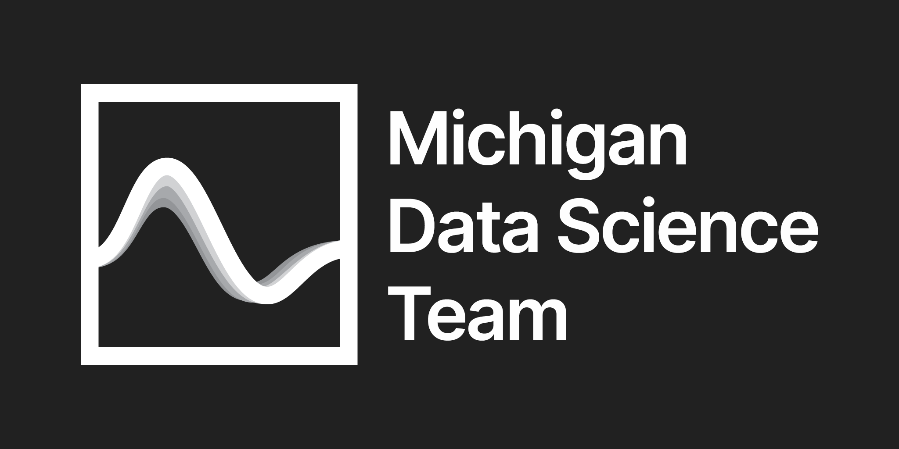

# 2024-Full-Time by MDST

Welcome to the 2024 data science full-time positions repo by Michigan Data Science Team!

| Company | Role | Location | Min. Degree | Notes |
| ------- | ---- | -------- | ----------- | ----- |
| [HPE](https://careers.hpe.com/us/en/students) | [AI/ML Graduate](https://careers.hpe.com/us/en/job/1160957/Artificial-Intelligence-AI-Machine-Learning-ML-Graduate) | Various Locations | Bachelors |
| [HPE](https://careers.hpe.com/us/en/students) | [Data Science Graduate](https://careers.hpe.com/us/en/job/1160953/Data-Science-Graduate) | Various Locations | Bachelors |
| [Sony Music](https://www.sonymusic.com/careers/) | [Data Analytics Roation Training Program](https://boards.greenhouse.io/sonymusic/jobs/6916340002) | New York | Bachelors |
| [Verdant Robotics](https://jobs.lever.co/verdantrobotics) | [ML DevOps Engineer](https://jobs.lever.co/verdantrobotics/5ffd262f-ca16-4683-963b-933b6dab1467) | Hayward, CA | Bachelors | 
| [Voleon Group](https://voleon.com/index.html%3Fp=124.html) | [Data Scientist](https://jobs.lever.co/voleon/ebd0306d-4353-4b10-be9d-479af8127617) | Berkeley, CA | Masters |
| [DraftKings](https://careers.draftkings.com/students-grads/entry-level/) | [Associate Analyst](https://draftkings.wd1.myworkdayjobs.com/Campus_Career_Portal/job/Boston-MA/Associate-Analyst--December-2023-and-May-2024-Grads-_JR07276) | Boston | Bachelors |
| [DraftKings](https://careers.draftkings.com/students-grads/entry-level/) | [Data Science Engineer](https://draftkings.wd1.myworkdayjobs.com/Campus_Career_Portal/job/Boston-MA/Data-Science-Engineer_JR06976) | Boston | Bachelors |
| [Harmony](https://open.harmony.one/yearn-for-vast-and-endless-sea) | [AI Backend Engineer](https://jobs.lever.co/harmony/80681513-b887-4a9b-b725-6bba0e7e4e9f) | Palo Alto, CA |
| [Point 72](https://point72.com/students-early-career/) | [Data Scientist, Proprietary Research](https://boards.greenhouse.io/point72/jobs/4644238002) | New York | Bachelors |
| [Databricks](https://www.databricks.com/company/careers) | [Data Scientist](https://www.databricks.com/company/careers/university-recruiting/data-scientist---new-grad-2024-start-6866554002) | San Francisco | Masters |
